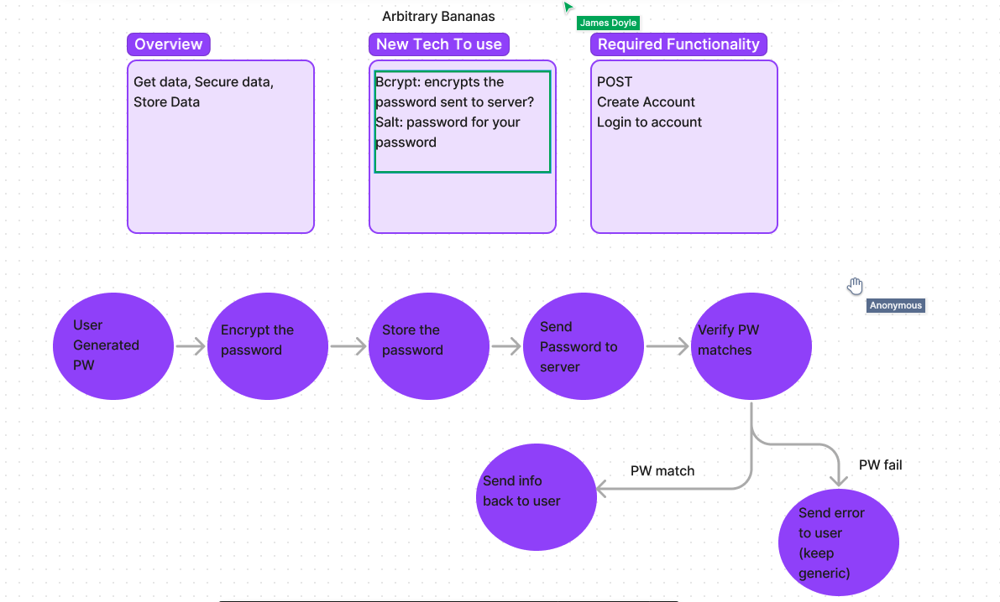

# LAB: Authentication Lab 06
Assignment:
Authentication System Phase 1: Deploy an Express server that implements Basic Authentication, with signup and signin capabilities, using a Postgres database for storage.

# Lab: Bearer Authorization 07
Assignment:
Authentication Server Phase 2: Token (Bearer) Authentication
At this point, our auth-server is able to allow a user to create an account as well as to handle Basic Authentication (user provides a username + password). When a “good” login happens, the user is considered to be “authenticated” and our auth-server generates a JWT signed “Token” which is returned to the application
We will now be using that Token to re-authenticate users to shield access to any route that requires a valid login to access.

# Lab: Bearer Authorization 08
Assignment:
Authentication Server Phase 3: Role Based Access Control
Being able to login is great. But controlling access at a more granular level is vital to creating a scalable system. In this lab, you will implement Role Based Access Control (RBAC) using an Access Control List (ACL), allowing to not only restrict access to routes for valid users, but also based on the individual permissions we give each user.

## Approach & Efficiency
- Lab 08 : I made sure to read the instruction completely and not skim it. David gave us the solution code for v1, and based on the assignment we  had to create a second route called v2. I did some refactoring, and a lot of troubleshooting, which helped a lot with understanding all the moving parts.

# Pull Request
- [Github-Action]("not passing right now")
- [PR-08]<https://github.com/Marthaquinram/basic-auth/pull/9>

# Starting up
ensure you have your .env file set up
exapmle PORT=(enter in port number here)
- In terminal run npm i to install dependencies and then run npm test to run all test.
- In terminal run npm i jsonwebtoken to install and be able to utilize JWTs
- In terminal run brew install sqlite3, sequalize
- Add DATABASE_URL with heroku postgres link to .env file.
- Use thunderclient for testing locally.

# Notes:
- worked on lab 06 with a bunch of classmates and reviewed demo/lecture video.
- I think I completed Lab 07, test are passing and I was able to implement security measure with a timer. Added it to .env
- got most of lab 08 completed, still need to work on testing.

### Testing
I tested routes and JWT in Thunderclient, Postman, Insomnia and it worked.

# UML

- 

### Collaborators:
- Lab 06 - Zoom Video(David), Luis, Danny, Sarah, Jim, Tony.
- Lab 07 - Zayah, Jim, Danny, Sarah, Tony
- Lab 08 -  Danny C. and  Tony R.
